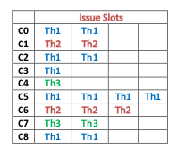
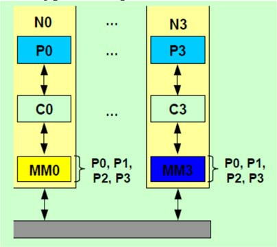

## DOMANDE APERTE

### 13/09/2019

**QUESTION 1:** (6 points): MULTITHREADING

1. Explain how Simultaneous Multithreading (SMT) works and which are the main
differences with respect to Fine-grained Multithreading, providing advantages and
disadvantages
2. Consider a Simultaneous Multithreading machine with limited hardware resources. For each of
  the following hardware constraints indicate which ones can limit the total number of threads that
  the machine can support and explain why:
  1.  Number of Functional Units
  2. Number of Register Files and Program Counter registers
  3. Data Cache Size

**QUESTION 2:** CACHE MEMORIES (4 points)
Given a cache of a given capacity, associativity and block size, answer TRUE or FALSE to the
following questions, motivating your answers

* Doubling the cache capacity of a direct mapped cache usually reduces conflict misses T **True**

* Doubling the block size reduces compulsory misses **True**
* Adding a victim cache reduces conflict misses **False**
* Change the nesting of loops in the code to access data in order stored in memory will increase
  spatial locality, possibly reducing the miss rate T **True**

### 10/01/2020

**QUESTION 1:** MEMORY HIERARCHY (5 points)
Consider the following techniques, explain their impact on hit time, miss rate or miss penalty of the
L1 cache, justifying your answer.

* Add a sub- blocking scheme
* Add a victim cache
* Add hardware prefetching
* Add L2 cache
* Avoid address translation

**QUESTION 2:** VECTOR PROCESSORS (5 points)
Given a vector processor architecture, as VMIPS shown in Figure, present the advantages of vector
execution with respect to scalar execution, detailing the features of the vector architecture that
provide the advantage.

## VERO-FALSO

##### 

### 15/07/2019

Q1) Compulsory misses (also called cold start misses) in cache memories are dependent on cache
size
Answer: **FALSE**

Q2) In a VLIW processor, the compiler statically knows the behavior of data cache misses and
branch mispredictions
Answer 1: **(FALSE)**

Q3) In SMT processors, the fetch unit can fetch from more threads at the same clock cycle.
Answer 1: T**(TRUE)**

Q4) How does the Write Invalidate Protocol (with Write-Through cache) handle a Write Miss?
(MULTIPLE TRUE ANSWERS)
Answer 1: Write misses cannot occur with a Write-Through Write Invalidate Protocol
Answer 2: The cache block is retrieved from memory **(TRUE)**
Answer 3: Before write completion all other cached copies of the block are set to “Invalid” **(TRUE)**
Answer 4: The most recent copy of the block is retrieved from the caches

Q5) In the speculative Tomasulo architecture, which buffers are completely replaced by the
ReOrder Buffer? (SINGLE TRUE ANSWER)
Answer 1: Load Buffers
**Answer 2: Store Buffers**

Q6) Let us consider a computer with L1 and L2 caches with the following parameters: Processor
Clock Frequency = 1 GHz; Hit Time L1 = 1 clock cycle ; Hit Rate L1 = 95%; Hit Time L2 = 5
clock cycles; Hit Rate L2 = 90% ; Miss Penalty L2 = 15 clock cycles; How much is the Global Miss
Rate for Last Level Cache? (SINGLE TRUE ANSWER)
Answer 1: 5%
**Answer 2: 0.5%**
Answer 3: 10%
Answer 4: 7.5%

### 13/09/2019

Q1) In MIMD architectures, the concepts of physical memory organization and logical memory
address space are independent to each other
Answer: T **True**

Q2) According to the Amdahl’s Law, the performance improvement to be gained from using some
faster execution modes is limited by the fraction of the time the faster mode can be used
Answer: T **True**

Q3) Address aliasing can generate mispredictions in a Branch History Table, especially with few
entries
Answer: T **True**

Q4) The 2-bit BHT offers a better accuracy with respect to a 1-bit BHT due to the following reason:
(SINGLE ANSWER)
Answer 1: The prediction must miss twice before it is changed **TRUE**
Answer 2: The prediction takes into account the history of another branch
Answer 3: The prediction is combined with a static prediction

Q5) What are the disadvantages of VLIW processors? (Multiple answers)
Answer 1: Increment of code size. **(TRUE)**
Answer 2: Increment of power consumption
Answer 3: Binary incompatibility. **(TRUE)**
Answer 4: Large number of registers needed for register renaming. **(TRUE)**

Q6) Considering a multiprocessor system where shared variables are often subject to a high
number of consecutive writes by the same processor, which coherence protocol should be
preferred? (SINGLE ANSWER)
Answer 1: Write Update
Answer 2: Write Invalidate **(TRUE)**
Answer 3: Indifferent

### 10/01/2020

Q1) Fine-grained multithreading aims at speeding up the execution time of each individual thread.
Answer: **False**

Q2) In the speculative Tomasulo architecture, exceptions are taken when the instruction that
generated them reaches the head of the ROB.
Answer:  **True**

Q3) Which of the following sentences represent the main Tomasulo drawbacks?
Answer 1: It requires a large amount of hardware. T **(TRUE)**
Answer 2: The performance might be limited using a single Common Data Bus. T **(TRUE)**
Answer 3: Reservation Stations limit the amount of functional units that can be used. T
Answer 4: It doesn’t have a way to handle RAW hazards T

Q4) Consider a five stage MIPS pipeline with precise exceptions, which statements concerning
exception handling are correct?
Answer 1: Since the instructions are issued in-order the exceptions occur in-order. T
Answer 2: Exceptions can be handled as soon as they occur. T
Answer 3: Exceptions are handled in the order in which they would occur in an unpipelined
processor. T **(TRUE)**
Answer 4: It’s possible for instructions executing after a (not yet handled) exception to change the
state of the processor. T

Q5) The time window in the following picture represents 3 threads running over time:

Answer 1: Coarse-grained Multithreading
Answer 2: Fine-grained Multithreading **(TRUE)**
Answer 3: Simultaneous Multithreading

Q6) The architecture in the following picture represents:

Answer 1: Centralized Memory; Single Logically Shared Address Space
Answer 2: Centralized Memory; Message Passing Architectures
Answer 3: Distributed Memory; Single Logically Shared Address Space  **TRUE**
Answer 4: Distributed Memory; Message Passing Architectures