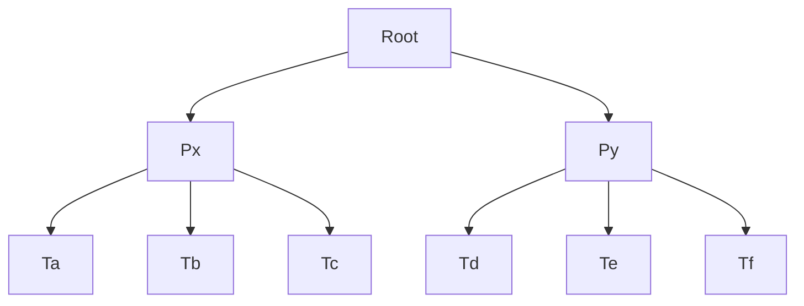

### Hierarchical Locking Example

**Soluzione:**

| Root               | *Px*        | Ta                          | Tb   | Tc   | *Py* | Td   | Te   | Tf   | OPERAZIONE |
| ------------------ | ----------- | --------------------------- | ---- | ---- | ---- | ---- | ---- | ---- | ------------------ |
| $ISL_1$            | $ISL_1$     | $SL_1$                      |      |      |      |      |      |      | r1(Ta) |
| $ISL_{2}$          |             |                             |      |      | $ISL_2$ | $SL_2$ |      |      | r2(Td) |
| $ISL_{1,3}$       | $ISL_{1,3}$ | $SL_{1,3}$ |      |      |      |      |      |      | r3(Ta) |
| $IXL_{1}, ISL_{3}$ | $IXL1,ISL3$ | $XL1$:stop_sign:->T1 messa in coda |      |      |      |      |      |      | w1(Ta)     |
| $IXL_2$ |             |  |      |      | $IXL_2$ | $XL_2$ |      |      | w2(Td) |
| $IXL_{1,3}$ | $IXL_{1,3}$ | $XL_3$-> T3 commits and releases lock | | |  |  | | | w3(Tb) |
| $IXL_1$ | $IXL_1$ | $IXL_1$ -> can now be granted | | |  |  | | | w1(Ta) |

