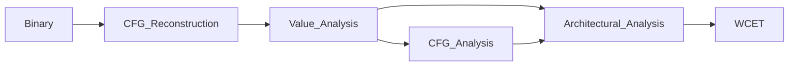

# Advanced Operating Systems

## OS Scheduling

* First In First Out (FIFO)
* Shortest Job First (SJF)
* Shortest Remaining Time First (SRTF)
* Highest Response Ratio Next (HRRN): $\frac{W_i + C_i}{C_i}$ dipende da computation time e waiting time
* Round Robin (RR)
* **Time Sharing**
  * I/O queue
  * Priority (multiple queues)
  * Priority with feedback
  * Aging
* **Multi Processor**
  * Single Queue
  * Multiple Queues
  * Hierarchical Queue

## Real-Time

***Predictability***: potential enemies

* Processor
* Cache
* Direct Memory Access (DMA)
* Interrupts
* System calls
* Memory management
* Locking mechanisms
* Programming language

***Scheduling algorithms***

* Timeline Scheduling (TS)
* Rate Monotonic (RM) 
* Earlieast Deadline First (EDF)
* Deadline Monotonic (DM)

## Worst-Case Execution Time

***Steps***

***Co-Running Tasks***

* The Murphy approach
* Integrated Analysis
* Partitioning and Isolation
* Time composability

***Probabilistic Approaches***

* Static Probabilistic Timing Analysis (SPTA)
* Measurement-Based Probabilistic Timing Analysis (MBPTA)

## Multithreading

***Tools***

* Semaphore
* Mutex
* Condition Variables

***Deadlocks***

A resource deadlock arise from four conditions simultaneously
holding

* Mutual exclusion – shared resources can be used by one and only
  one task
* No resource preemption – shared resources can be release only by
  the owning task
* Hold and wait – a task waits to acquire further resources, while
  holding at least one already
* Circular wait – a circular dependency among tasks, e.g., a task T0
  waits for a resource held by task T1, which waits for a resource held
  by T0

***Priority Inversion***

Resource Access Protocols to manage the access to shared resources:

* Non-Preemptive Protocol (NPP): Avoid preemption during the execution of any critical section
* Highest Locker Priority (HLP): Raise the priority of the task holding the lock/resource $R_k$ up to the highest (nominal) priority among the tasks sharing the resource
* Priority Inheritance (PIP): When $T_i$ tries to enter a critical section $z_{i,k}$ with a resource $R_k$
  already held by a lower-priority task $T_j$ , its active priority is transmitted to the task $T_j$ (push-through blocks)
* Priority Ceiling (PCP): Extend Priority Inversion Protocol with a rule on semaphores to avoid multiple locking
  * Do not allow a task to enter a critical section if there are locked semaphore that could block it
  * Once entered a critical section, a task cannot be blocked by lower priority ones until its completion

## Mutithreading in C++

* mutex
* scoped mutex
* cond_var
* recursive_mutex

**Patterns**

* Producer-consumer (synch queue)
* Active Object
* Reactor

**Functions**

* TODO

## Inter Process Communication

* Signals
* Unnamed queue
* Named queue
* Message queue
* Shared memory
* Semaphores

