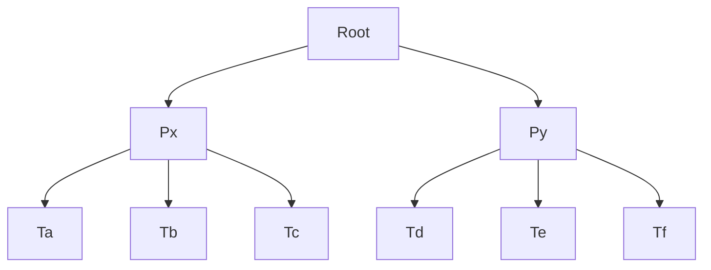

## ToC

[TOC]


## Diagrammi




```sequence
Alice->Bob: Hello Bob, how are you?
Note right of Bob: Bob thinks
Bob-->Alice: I am good thanks!
```

 ## Latex

$$
S_1 -> aS_1a
$$

## Codice

```java
class a extends b {
    public int a;
    public int b;
}
```

## Tabelle

| Root    | $P_X$       | $t_A$ | $t_B$ | $t_C$  | $P_Y$ |
| ------- | ----------- | ----- | ----- | ------ | ----- |
| $ISL_1$ | $ISL_{1,2}$ | X     | X     | $XL_2$ |       |

