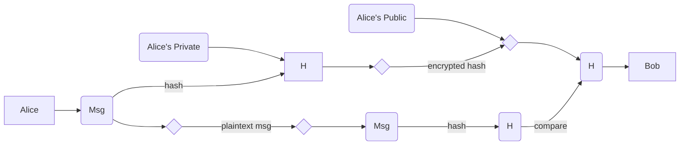

# BASICS

**Confidentiality:** only some can see<br/>
**Integrity:** only authorized people can modify<br/>
**Availability:** conflicts with C&I!

**Vulnerabilities:** A bug that enables to violate one of the **CIA** constraints<br/>
**Exploits:** A specific way to use one or more <u>vulnerabilities</u>

* *<u>N.B</u>. The vulnerability might be known but not the exploit*

**Assets:** What is valuable for an organization (HW, SW, data, reputation, friends...). Since we cannot build invulnerable systems, we need to focus on the assets first.<br/>
**Threats:** Potential CIA violation

* DOS $\rightarrow​$ Availability
* Identity theft $\rightarrow$ Integrity
* Data Leak $\rightarrow$ Confidentiality

**Threat Agent:** Who performs an attack

* Hackers showing off
* Directed attack
* Profit-oriented criminals
* Espionage
* Activism
* State-founded

---

:warning: **SECURITY $\neq$ PROTECTION**: Security depends on <u>assets</u> and <u>threats</u>: USA president is more protected but less safe than a normal citizen.

---

**Risk:** <u>Assets</u> $ \times$ <u>Vulnerabilities</u> $\times​$ Threats (first two are controllable)<br/>
**Security:** Has to balance the reduction of vulnerabilities with costs, direct and <u>indirect</u> (less usability, less performance).

# CRYPTOGRAPHY

**Definition:** 1949 Shannon, *Communication theory of secrecy systems*

  ```mermaid
  graph LR
      B(Plaintext) --> C{CRYPTO<br/>SYSTEM}
      C --> D[Ciphertext]
      D -->|KEY| B
  ```

**Kerckhoff Principle:** Security relies on the secrecy of the <u>key</u>, never on the secrecy of the algorithm.

  1883, *La Cryptographie Militaire*

**Perfect Cipher** (Shannon): No matter how much time/strength is spent, no secret will be leaked. <br/>This means that the probability of reading a message M is equal with or without the cyphertext.
$$
P(M=m\ |\ C=c)\ =\ P(M=m)
$$
Possible only if key length is same of message length.
$$
  |K|\ge|M|
$$
**OTP** (One Time Pad)  $\rightarrow​$ minimal perfect cipher
$$
Ciphertext = m\ XOR\ k\quad\quad\quad len(m)=len(k)
$$
Practically infeasible.

**Real Cryptosystems:** Can always be bruteforced, hence <u>no real system is invulnerable</u>.

---

:warning: A real cryptosystem is **broken** if it can be breaked <u>faster than bruteforcing</u>.<br/>:warning: There is no way to prove the robustness of a cypher, a part from breaking it.

---

## Symmetric Encryption

<u>Same key</u> is used to encrypt and decrypt.


**Ingredients**

* **Substitution**, but alone is too week (repetitions and patterns are still visible).
* **Transposition** e.g. using a Matrix

**Modern solutions**

* DES (56 bit key)
* AES
* RC5

**Robustness**

* Encryption in $O(n)$
* Decryption w/ bruteforce $O(2^n)$

## Asymmetric Encryption

What is encrypted with <u>KEY1</u> can be decrypted only with <u>KEY2</u>.


**Commonly used**

* Diffie Hellmann $\rightarrow​$ Log-mod
* RSA $\rightarrow​$ Prime sum factorization
* DSS
* ECC $\rightarrow$ Elliptic Curve Cryptography

**Diffie Hellmann**

Based on the modular logarithm $Y = a^x\ modp$ (computing $x$ knowing $y​$ is difficult).

1. Pick **p** prime, **a** primitive root of p (a.k.a a number such that $\forall n \in[1, p-1]\ \exists k \ \ |\ \ a^kmodp=n$).

2. Each part picks a number between 1 and $p-1$:
   $$
   X_A, X_B \in [1,p-1]
   $$

3. Each part builds a public key
   $$
   \begin{equation}
   \begin{cases}
   P_A = a^{X_A}modp\\
   P_B = a^{X_B}modp
   \end{cases}
   \end{equation}
   $$

4. After exchanging the public keys, each can now build a secret key
   $$
   \begin{equation}
   S_A = S_B \ \
   \begin{cases}
   S_A = P_B^{X_A}modp\\
   S_B = P_A^{X_B}modp
   \end{cases}
   \end{equation}
   \\
   $$

**RSA** 

Uses prime number factorization  $n=p\times q​$

* Encryption is <u>linear</u> in the number of bits

* Factoring is <u>exponential</u> in the number of bits of $n$

---

:warning: You cannot compare asymmetric algorithms based on key length .<br/>:warning: You can never compare symmetric and asymmetric algorithms (in **symmetric** we measure the number of <u>decryption</u> attempts, in **asymmetric** we measure the number of <u>key-breaking</u> attempts).

---

## Hash Functions

**Hash Function:** $H(x)$ maps a variable input $x$ to a fixed length output $h$.

**Possible Attacks:** normally it's computationally infeasible to do these attacks.

* <u>Preimage attack</u>, given $h$ find $x$
* <u>Second Preimage attack</u>, given $x$, find $y$ with same $h$
* <u>Collision attack</u>, find a couple $(x,y)$ with same $h$

**Commonly Used **

* SHA1 (160 bit)
* SHA2 (256 bit)
* MD5 (128 bit)

**Broken Hash Functions:** given $n​$ the number of output bits, we need

* $2^{n-1}$ for <u>arbitrary collisions</u> (1st or 2nd preimage attacks)
* $2^{n/2}$ for <u>simplified collisions</u> (e.g. given 367 people, the probability that 2 have the same birth is 100%).

## Digital Signature

**Authentication**: encrypt with private key, decrypt with public key to be sure that was encrypted by Alice.


**Digital Signature:** check authentication & integrity 



1. Sender hashes the message
2. Sender encrypts hash with private key
3. Sender sends message (plaintext) + hash (encrypted)
4. Receiver decrypts hash with sender's public key
5. Receiver calculates hash of received message
6. Receiver compares calculated hash with decrypted hash

**PKI** (*Public Key Infrastructure*): nedeed to be sure <u>who</u> signed a message. 

The idea is to use a third party authority, called **CA** (*Certificate Authority*) to sign <u>certificates</u> that bind <u>public keys</u> to **DN**s (*Distinguished Name*).

Who ensures the signatures of a CA? Another CA. This happens recursively until the **Root CA**, which issues a self-signed certificate.

**CRL ** (*Certificate Revocation Lists*) are also needed to list all revoked certificates (keys cannot be destroyed).

**Verification Sequence:**

1. Verify that the signature validates the message
2. Verify that the Public Key of the signature matches the certificate
3. Check the DN name of the certificate
4. Check that the CA who released the certificate is trusted (recursively until root CA $\rightarrow​$ *chain of trust*)
5. Check CRLs

# AUTHENTICATION

**Identification:** an entity declares its identifier, e.g. login<br/>**Authentication:** the entity provides a *proof* that verifies the identity, e.g. password

#### 1. To known factor

E.g. <u>password</u>.

* **Advantages:** cost and easy to develop.
* **Disadvantages & Countermeasures:**

    | Disadvantages       | Countermeasures                              |
    | ------------------- | -------------------------------------------- |
    | Stealing (snooping) | Change frequently                            |
    | Guessing            | Not related to the users, change, complexity |
    | Craking             | Complexity, Change                           |

    :warning: Humans are not good at remembering passwords! If too difficult/too many changes $\rightarrow​$ post-it on PC.

To **minimize the risk** of a shared secret getting stolen, we can:

* Use *mutual authentication*

* Use *random data* to avoid **replay** attacks

* Use a ***challenge-response scheme*** 

  ```mermaid
  sequenceDiagram
      Alice->>John: Hi!
      John->>John: calculate random R1
      John->>John: hash(R1 + secret)
      John->>Alice: R1
      Alice->>John: hash(R1 + secret)
      Alice->>Alice: calculate random R2
      Alice->>Alice: hash(R1 + secret + R2)
      Alice->>John: R2
      John->>Alice: hash(R1 + secret + R2)
  ```

#### 2. To Have factor

E.g. <u>token, key</u>. 

- **Advantages:** good level of security, humans are less likely to hand out a key.

- **Disadvantages & Countermeasures:**

  | Disadvantages         | Countermeasures        |
  | --------------------- | ---------------------- |
  | Hard to deploy        | None                   |
  | Can be lost or stolen | Use with second factor |

- **Examples:** 

  - One Time Password generators: client encrypts <u>counter</u> with private key, host decrypts with public key and verifies the counter.
  - Smart Cards: non volatile RAM keeps private key, uses *challenge-response*
  - Smartphone password generators. Worse than dedicated generators (HW is not dedicated $\rightarrow$ vulnerable).

#### 3. To be factor

E.g. <u>fingerprints</u>. 

- **Advantages:** high level of security, no extra hardware to carry around.

- **Disadvantages & Countermeasures:**

  | Disadvantages                 | Countermeasures  |
  | ----------------------------- | ---------------- |
  | Hard to deploy                | None             |
  | Non deterministic measurement | None             |
  | Change over time              | Re-measure often |
  | Invasive                      | None             |
  | Can be clones                 | None             |

- **Examples:** 

  - Fingerprint
  - Face form
  - DNA

# BINARY

## Buffer Overflow

**Buffer Overflow Vulnerability: ** a program is vulnerable if it allows an attacker to write arbitrary values beyond a function's frame, overwriting the function's return pointer with a location in memory that contains code that the attacker can somehow control. Thus, the machine will act according to its specifications, but instead of jumping to the true return pointer as expected by the programmer, it will jump somewhere else.

**Dove mettere lo shellcode:**

* Se il buffer è abbastanza grande, mettere lo shellcode alla fine del buffer con prima delle `NOP`.
* Se non ci sta nel buffer, mettere lo shellcode in una variabile d'ambiente `$EGG` e emettere nell'`EIP` l'indirizzo di `$EGG`.

***Solutions***

* **Source Code Defenses**

  * Source code analyzers
  * Use safe libraries
  * Dynamically allocate buffers

* **Compiler Level Defenses**

  * Randomize ordering of stack variables
  * Canary 
    * *<u>terminator</u>*: fatto di caratteri `\0` per impedire la sovrascrittura con `scanf(%s)`<br/> $\rightarrow$ Come fotterlo: *Devo poter scrivere direttamente oltre il canary*
    * *<u>random</u>*: chosen at runtime, saved in a register, placed <u>after the sEBP</u> in function prologue and compared in the function epilogue. <br/>$\rightarrow​$ Come fotterlo: *Memory Leakage del canary*
    * *<u>random XOR</u>*

* **OS Level Defenses**

  * Non executable stack (**W^X**) <br/>$\rightarrow​$ Come fotterlo: *Ret to libc*

    |                                  | Content of the Stack           |
    | -------------------------------: | ------------------------------ |
    |     *Arguments of libc function* | Address of **X**               |
    | *Where to return after system()* | `exit`                         |
    |              *EIP* $\rightarrow$ | Pointer to function *system()* |
    |              *EBP* $\rightarrow$ | sEBP                           |
    |                          ***X*** | `\bin\sh`                      |

  * Address Space Layout Randomization (**ASLR**) <br> $\rightarrow$ Come fotterlo: *Memory Leakage del sEBP o un qualsiasi puntatore*

  

## Format Strings

* Vulnerable functions: printf, fprintf, sprintf, snprintf...

  * `printf(char*)`
  * `snprintf(buf, 250, char*`)

* Se come stringa uso `%x %x %x`... posso leggere lo stack $\rightarrow$ **memory leak**

  * `%10\$x` serve per leggere il decimo indirizzo sopra nello stack

  * ```
    for i in `seq 1 150`; do echo -n "$i " && ./vuln "AAAA %$i\$s"; done
    ```

  * Posso usarla ad es. per trovare la posizione di una variabile globale

* **Per scrivere** I want to write 0xXXXXYYYY in target address $tgt$

  ```
  case XXXX < YYYY
  	<tgt+2(hex)> <tgt(hex)> %<XXXX(dec)-8>c %<pos(dec)>$hn %<YYYY-XXXX(dec)>c %<pos+1(dec)>$hn
  case XXXX > YYYY
  	<tgt(hex)> <tgt+2(hex)> %<YYYY(dec)-8>c %<pos(dec)>$hn %<XXXX-YYYY(dec)>c %<pos+1(dec)>$hn
  ```

* Countermeasures

  * Quelle per buffer overflow
  * Checkare il numero di parametri e il umero di placeholder

* General case

  * a so-called variadic function
    *  a variable number of parameters
    * the fact that parameters are "resolved" at runtime by pulling them from the stack
  * a mechanism (e.g., placeholders) to (in)directly r/w arbitrary locations
  * the ability for the user to control them

----

# Web Vulnerabilities

**SQL Injection** There must be a data flow from a  user-controlled HTTP variable (e.g., parameter, cookie, or other header fields)  to a SQL query,  without appropriate filtering and validation . If this happens, the SQL structure of the query can be modified .

<u>Solutions</u> 

* Server Admin: Escaping, prepared queries
* DB admin: restrict access on tables

**Reflected XSS** It creates a per-request dataflow that originates from the client's rendered page (e.g., input field or other HTTP variable), ending up on the client's rendered page (e.g., interpreted HTML or JS content) as a result of the server response 

**Stored XSS** There must be a data flow from a user-controlled HTTP variable (e.g., parameter, cookie, or other header fields) to a database that is then used to populate the HTTP response, without appropriate filtering and validation. If this happens, the content injected will be rendered back at each response.

<u>Solutions</u>

* Server Admin: Escaping, filtering
* CSP: disables inline scripts by default. Scripts can 

**CSRF** Forces an user to execute unwanted actions (**state-changing actions**) on a web application in which he is currently authenticated (e.g., with cookies). This can happen when the application authenticates the user only with “ambient credentials” (cookies, which are sent automatically with every request)

<u>Exploit</u>

Attacker sends a malicious link to the victim, which is logged in with the bank's account (i.e. has a cookie). The link redirects the victim browser to a page with a precompiled hidden form which is then sent to the bank's website. The bank's site cannot know if it has been forged or is legitimate, so it will execute the state-changing action.

<u>Solutions</u>

* **CSRF token:** Send a different token (e.g. in HTTP header) at each request and ask the user to send it back at next request (e.g. hidden field in form that contains the received token.)

**Sequence of Validation**

1. Whitelist
2. Blacklist
3. Escape characters that are needed to be displayed

# Malware

**Viruses**: self-propagate by infecting other files, usually executables (but also documents with macros, bootloader code). They are not programs (i.e., not executables).

**Worms**: programs that self-propagate, even remotely, often by exploiting host vulnerabilities, or by social engineering (e.g., mail worms).

<u>Defenses</u>:

* Patches
  ○ Most worms exploit known vulnerabilities
  ○ Useless against zero-day worms
* Signatures (**antivirus**)
  ○ Must be developed automatically
  ○ Worms operate too quickly for human response
* Intrusion or anomaly detection
  ○ Notice fast spreading, suspicious activity.
  ○ Can be a driver to automated signature generation

**Trojan horses**: apparently benign program that hide a malicious functionality and allow remote control.

## Antivirus and Anti-malware

* Basic strategy: **signature-based detection**
  * database of byte-level or instruction-level signatures that match malware
  *  wildcards can be used, regular expressions common
* **Heuristics** (check for signs of infection)
  * code execution starts in last section
  * incorrect header size in PE header
  * suspicious code section name
  * patched import address table
* **Behavioral Detection**
  * detect signs (behavior) of known malware
  * detect “common behaviors” of malware

#### Countermeasures

* **Ex-post workflow**
  1. suspicious executable reported by "someone"
  2. automatically analyzed
  3. manually analyzed
  4. antivirus signature developed
* **Static analysis**: Parse the executable code
  * PRO: code coverage, dormant code
  * CON: obfuscation
* **Dynamic Analysis**: observe the runtime behaviour
  * PRO: good against obfuscation 
  * CON: no complete code coverage

## Malware Stealth Techniques

* **Polymorphism**
  * Change layout (shape) with each infection
  * Payload is encrypted (~ packing)
    *  using different key for each infection
    * makes static string analysis practically impossible, but AV could detect encryption routine
* **Metamorphism**
  * Create different “versions” of code that look different
* **Packing**
  * Encrypt with differet key everytime (like polymorphism)
  * Additionally:
    * Compress/Decompress
    * Anti-debugging techniques
    * Anti-VM techniques
    * Virtualization