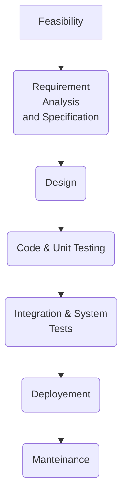
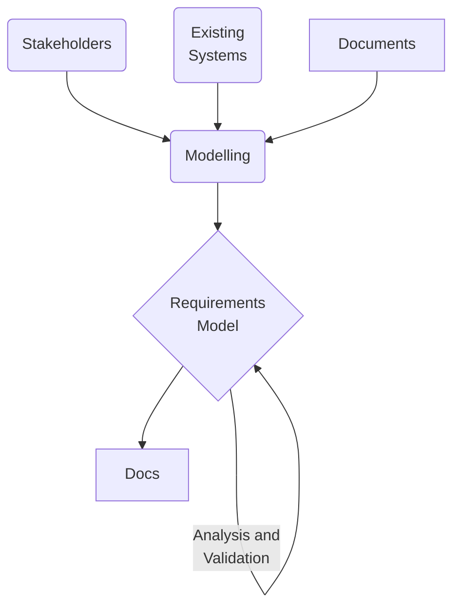

# SOFTWARE QUALITY (20 Sett)

Software products are becoming more and **more complex** (e.g. Debian 320 million lines), lots of people involved, perform critical decisions (e.g. rockets, biomedical ...).

There are different **aspects** affecting the software product quality:

* Process quality (*HOW* we do it)
* Cost and Time
* People Quality
* Development Technology

There needs to be a way to **verify the quality** of the software product like we do for physical artifacts, even if it is untangible.

## Product Quality Attributes

**I - perceived by the user (external)**

* Correctness
  * Rispetto alle specifiche, se le specifiche sono fatte male e non fanno quello che l'utente si aspetta è un altro discorso
* Reliability
	* <u>Probability of abscence of failure</u> for a certain period
	* Can be expressed mathematically
* Robustness
	* SW behaves reasonably in unforseen circumstances
* Performance (efficient use of resources)
* Usability (user interface and tailor software on the type of user: elder people, blind users)

**II - perceived from the developer (internal) -> affects the final product's ability to change**

* Maintainability
* Reusability (reuse software for other projects)
* Portability (reuse software with different hardware)
* Interoperbility

## Process Quality

* Productivity (measured in unity of effort: *person month*. 10 person months = one person working for 10 months, or 2 persons one for 4 months and another for 6 months)
  * generally speaking one person working for 10 months is not the same of 10 people working for one month (needs for coordination ad organization)

* Timeliness: respond to user needs in a timely fashion
  * sometimes we have to work on the code without developing new features (adding robustness, verifying ...)

## Lifecycle

* Initially projects lifecycle was **Code & Fix**: write code, find bugs, fix bugs, other code, ecc...

* After many problems, **Waterfall Model ** was adopted

#### Waterfall Model

* Standardized output after every phase:
	* Feasibility Document
	* Requirement Analysis and Specification Document (RASD)
	* Design Document
* Tests:
	* Unit -> isolated pieces
	* Integrated -> together in subsystem and the in the whole system
	* Alpha/Beta tests
* Manteinance:
	* Corrective (repair faults): 20%
	* Adaptive (change in environment): 20%
	* Perfective (new requirements): 50%
	* Preventive (increase maintainability): 5%

#### Other Models

- Fast prototyping (prototype = approximate model, can be refined or thrown away)
- Incremental delivery: start from critical features, receive feedback while developing the next features, beta versions
- DevOps
  - Difference between Development(release product) and Operations (give service)
  - DevOps tries to create a collaborative mindset by bridging the gap between dev and ops
- Open Source: many developers, difficult managing
  - E.g. apache, 15 members have the final decision on commits

# REQUIREMENTS ENGINEERING (1 Ott)

* Requirements need to be *engineered*, i.e. they need a formal process to be created, reviewed and revisioned.
* Requirements are **critical**: fixing a requirement problem during development can cost 200 times more than fixing it at the beginning
  *  This is because many decisions are made from requirements

## Requirements Types

* **Functional** requirements: Describe the interactions between the system and its environment
  independent from implementation. Are the <u>main goals</u> the software to be has to fulfill.

  *Examples:*
  A word processor user should be able to search for strings in the text
  The system shall allow users to reserve taxis

* **Nonfunctional** requirements:
  User visible aspects of the system not directly related to functional behavior. Also called QoS (Quality of Service)

  ​	**External**

  * Performance (respond in 5 seconds)

  * Reliability

  * Scalability

  * Capacity

  * Accuracy

  * Accessibility (should be accessed by smartphone)

  * Availability (should be available 24/7)
    **Internal**

  * Robustness (How the system works in unexpected conditions)

  * Exception handling

  * Interoperability

    **Security**

  * Integrity

  * Confidentiality

* **Constraints** (“pseudo requirements”):
  Imposed by the client or the environment in which the system operates

  *Examples:*

  The implementation language must be Java
  The credit card payment system must be able to be dynamically invoked by
  other systems relying on it

## RE Complexity

* They have a **broad scope**: when making requirements you have to take into account:
  * Composite systems (software, hardware, human organizations)
  * Multiple Systems (e.g. evolving an already existing systems)
  * Multiple Abstraction Levels
* There are **multiple concerns**
  * functional requirements, quality, development
  * hard(important) or soft(less important) concerns
* This complexity can create **conficts**
  * between stakeholders (clients, users, developers...)
  * between different concers (hardware vs software)

## RE Objectives

1. Elicit information
   1. Project scope, context, objective
   2. Domain knowledge
2. Modelling and analysing the requirements
3. Communicating requirements (documentation, standards)
4. Negotiating Requirements
   1. Solving conflicts
   2. Selection and **prioritization**
5. Evolving requirements (maybe the stakeholders find that somethiing changed from the first idea)
   1. Manage evolution, tracing requirements with the part of the system that implement them, impacts of changes

## RE Dimensions

* **System as is**: current situation, requires domain knowledge
  * Stakeholders
  * Existing systems
  * Documents
* **System to be**:
  * Software (to be developed, purchased, modified...)
  * Actors (persons, devices, old existing software)
  * Objectives (why is the system being modified?)
  * **Requirements Engineer** 
    * Identify services, constraints and assumptions that allow us to achieve the objectives
    * Assign the objectives to the single actors (persons, devices, old existing software...)

The RE takes the system as is and, through elicitation and modelling, builds **Requirements Models** (es. alloy). Models are useful because they can be analysed and validated (automatically or semi automatically) before having to realize the actual project.

