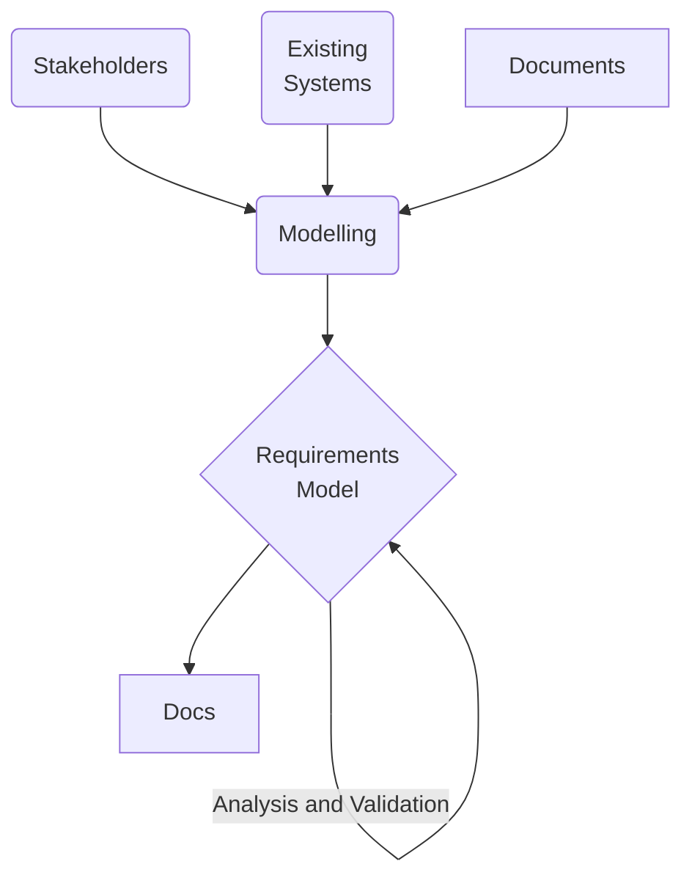

# SOFTWARE QUALITY (20 Sett)

Software products are becoming more and more complex, lots of people involved, perform critical decisions (e.g. rockets, biomedical ...).

There needs to be a way to verify the quality of a software product like we do for physical artifacts, even if it is untangible.

## Attributes

**I - perceived by the user (external)**

* Correctness
  * Rispetto alle specifiche, se le specifiche sono fatte male e non fanno quello che l'utente si aspetta è un altro discorso
* Reliability
	* <u>Probability of abscence of failure</u> for a certain period
	* Can be expressed mathematically
* Robustness
	* SW behaves reasonably in unforseen circumstances
* Performance (efficient use of resources)
* Usability (user interface and tailor software on the type of user: elder people, blind users)

**II - perceived from the developer (internal) -> affects the final product's ability to change**

* Maintainability
* Reusability (reuse software for other projects)
* Portability (reuse software with different hardware)
* Interoperbility

**III - Process Quality**

* Productivity (measured in unity of effort: *person month*. 10 person months = one person working for 10 months, or 2 persons one for 4 months and another for 6 months)
	* generally speaking one person working for 10 months is not the same of 10 people working for one month (needs for coordination ad organization)
* Timeliness: respond to user needs in a timely fashion
	* sometimes we have to work on the code without developing new features (adding robustness, verifying ...)

## Lifecycle

* initially code & fix

# REQUIREMENTS ENGINEERING (1 Ott)

* Requirements need to be *engineered*, i.e. they need a formal process to be created, reviewed and revisioned.
* Requirements are **critical**: fixing a requirement problem during development can cost 200 times more than fixing it at the beginning
	*  This is because many decisions are made from requirements

## RE Complexity

* They have a **broad scope**: when making requirements you have to take into account:
  * Composite systems (software, hardware, human organizations)
  * Multiple Systems (e.g. evolving an already existing systems)
  * Multiple Abstraction Levels
* There are **multiple concerns**
  * functional requirements, quality, development
  * hard(important) or soft(less important) concerns
* This complexity can create **conficts**
  * between stakeholders (clients, users, developers...)
  * between different concers (hardware vs software)

## RE Objectives

1. Elicit information
   1. Project scope, context, objective
   2. Domain knowledge
2. Modelling and analysing the requirements
3. Communicating requirements (documentation, standards)
4. Negotiating Requirements
   1. Solving conflicts
   2. Selection and **prioritization**
5. Evolving requirements (maybe the stakeholders find that somethiing changed from the first idea)
   1. Manage evolution, tracing requirements with the part of the system that implement them, impacts of changes

## RE Dimensions

* **System as is**: current situation, requires domain knowledge
  * Stakeholders
  * Existing systems
  * Documents
* **System to be**:
  * Software (to be developed, purchased, modified...)
  * Actors (persons, devices, old existing software)
  * Objectives (why is the system being modified?)
  * **Requirements Engineer** 
    * Identify services, constraints and assumptions that allow us to achieve the objectives
    * Assign the objectives to the single actors (persons, devices, old existing software...)

The RE takes the system as is and, through elicitation and modelling, builds **Requirements Models** (es. alloy). Models are useful because they can be analysed and validated (automatically or semi automatically) before having to realize the actual project.

